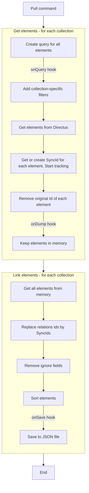

# Directus Sync


The `directus-sync` command-line interface (CLI) provides a set of tools for managing and synchronizing the schema and
collections within Directus across different environments.

By leveraging Directus's REST API, it aligns closely with the native actions performed within the application, ensuring
a high fidelity of operation.

Updates are granular, focusing on differential data changes rather than blunt table
overwrites, which means only the necessary changes are applied, preserving the integrity and history of your data.

Moreover, `directus-sync` organizes backups into multiple files, significantly improving readability and making it
easier to track and review changes. This thoughtful separation facilitates a smoother version control process, allowing
for targeted updates and clearer oversight of your Directus configurations.

**Table of Contents**

<!-- TOC -->
* [Directus Sync](#directus-sync)
  * [Requirements](#requirements)
  * [Usage](#usage)
    * [Commands](#commands)
      * [Pull](#pull)
      * [Diff](#diff)
      * [Push](#push)
      * [Untrack](#untrack)
    * [Available options](#available-options)
      * [CLI and environment variables](#cli-and-environment-variables)
      * [Configuration file](#configuration-file)
      * [Hooks](#hooks)
        * [Simple example](#simple-example)
        * [Filtering out elements](#filtering-out-elements)
        * [Using the Directus client](#using-the-directus-client)
    * [Lifecycle & hooks](#lifecycle--hooks)
      * [`Pull` command](#pull-command)
      * [`Diff` command](#diff-command)
      * [`Push` command](#push-command)
    * [Tracked Elements](#tracked-elements)
      * [Roles](#roles)
      * [Presets](#presets)
    * [Dependency: `directus-extension-sync`](#dependency-directus-extension-sync)
      * [Installation](#installation)
  * [How It Works](#how-it-works)
    * [Tagging and Tracking](#tagging-and-tracking)
    * [Mapping Table](#mapping-table)
    * [Synchronization Process](#synchronization-process)
    * [Schema Management](#schema-management)
    * [Non-Tracked Elements and Ignored Fields](#non-tracked-elements-and-ignored-fields)
    * [Strengths of `directus-sync`](#strengths-of-directus-sync)
  * [Directus upgrades](#directus-upgrades)
  * [Use Cases](#use-cases)
  * [Troubleshooting](#troubleshooting)
<!-- TOC -->

## Requirements

- Node.js 18 or higher
- `directus-extension-sync` installed on your Directus instance. See
  the [installation instructions](#dependency-directus-extension-sync).

## Usage

The CLI is available using the `npx` command.

```shell
npx directus-sync <command> [options]
```

Here's how to use each command in the CLI:

### Commands

#### Pull

```shell
npx directus-sync pull
```

Retrieves the current schema and collections from Directus and stores them locally. This command does not modify the
database.

It also retrieves the specifications (GraphQL & OpenAPI) and stores them locally.
It gets specifications from the `/server/specs/*` endpoints:

- [OpenAPI](https://docs.directus.io/reference/system/server.html#get-openapi-specification)
- [GraphQL SDL (Item & System scopes)](https://docs.directus.io/reference/system/server.html#get-graphql-schema)

#### Diff

```shell
npx directus-sync diff
```

Analyzes and describes the difference (diff) between your local schema and collections and the state of the Directus
instance. This command is non-destructive and does not apply any changes to the database.

#### Push

```shell
npx directus-sync push
```

Applies the changes from your local environment to the Directus instance. This command pushes your local schema and
collection configurations to Directus, updating the instance to reflect your local state.

#### Untrack

```shell
npx directus-sync untrack --collection <collection> --id <id>
```

Removes tracking from an element within Directus. You must specify the collection and the ID of the element you wish to
stop tracking.

### Available options

Options are merged from the following sources, in order of precedence:

1. CLI arguments
2. Environment variables
3. Configuration file
4. Default values

#### CLI and environment variables

These options can be used with any command to configure the operation of `directus-sync`:

- `-c, --config-path <configPath>`
  Change the path to the config file. Default paths are: `./directus-sync.config.js`, `./directus-sync.config.cjs` or
  `./directus-sync.config.json`.

- `-d, --debug`  
  Display additional logging information. Useful for debugging or verifying what `directus-sync` is doing under the
  hood.

- `-u, --directus-url <directusUrl>`  
  Specify the Directus instance URL. Alternatively, set the `DIRECTUS_URL` environment variable.

- `-t, --directus-token <directusToken>`  
  Provide the Directus access token. Alternatively, set the `DIRECTUS_TOKEN` environment variable.
  If provided, the `directus-email` and `directus-password` options are ignored.

- `-e, --directus-email <directusEmail> `  
  Provide the Directus email. Alternatively, set the `DIRECTUS_ADMIN_EMAIL` environment variable.

- `-p, --directus-password <directusPassword>`
  Provide the Directus password. Alternatively, set the `DIRECTUS_ADMIN_PASSWORD` environment variable.

- `--dump-path <dumpPath>`  
  Set the base path for the dump. This must be an absolute path. The default
  is `"./directus-config"`.

- `--collections-path <collectionPath>`  
  Specify the path for the collections dump, relative to the dump path. The default is `"collections"`.

- `-o, --only-collections <onlyCollections>`
  Comma-separated list of directus collections to include during `pull` `push` or `diff` process.

- `-x, --exclude-collections <excludeCollections>`  
  Comma-separated list of directus collections to exclude during `pull` `push` or `diff`. Can be used along with `only-collections`.

- `--snapshot-path <snapshotPath>`  
  Specify the path for the schema snapshot dump, relative to the dump path. The default is `"snapshot"`.

- `--no-snapshot`
  Do not pull and push the Directus schema. By default, the schema is pulled and pushed.

- `--no-split`  
  Indicates whether the schema snapshot should be split into multiple files. By default, snapshots are split.

- `--specs-path <specsPath>`  
  Specify the path for the specifications dump (GraphQL & OpenAPI), relative to the dump path. The default is `"specs"`.

- `--no-specs`  
  Do not dump the specifications (GraphQL & OpenAPI). By default, specifications are dumped.

- `-f, --force`  
  Force the diff of schema, even if the Directus version is different. The default is `false`.

- `-h, --help`  
  Display help information for the `directus-sync` commands.

#### Configuration file

The `directus-sync` CLI also supports a configuration file. This file is optional. If it is not provided, the CLI will
use the default values for the options.

The default paths for the configuration file are `./directus-sync.config.js`, `./directus-sync.config.cjs`
or `./directus-sync.config.json`. You can change this path using the
`--config-path` option.

The configuration file can extend another configuration file using the `extends` property.

This is an example of a configuration file:

```javascript
// ./directus-sync.config.js
module.exports = {
  extends: ['./directus-sync.config.base.js'],
  debug: true,
  directusUrl: 'https://directus.example.com',
  directusToken: 'my-directus-token',
  directusEmail: 'admin@example.com', // ignored if directusToken is provided
  directusPassword: 'my-directus-password', // ignored if directusToken is provided
  dumpPath: './directus-config',
  collectionsPath: 'collections',
  onlyCollections: ['roles', 'permissions', 'settings'],
  excludeCollections: ['settings'],
  snapshotPath: 'snapshot',
  snapshot: true,
  split: true,
  specsPath: 'specs',
  specs: true,
};
```

#### Hooks

In addition to the CLI commands, `directus-sync` also supports hooks. Hooks are JavaScript functions that are executed
at specific points during the synchronization process. They can be used to transform the data coming from Directus or
going to Directus.

Hooks are defined in the configuration file using the `hooks` property. Under this property, you can define the
collection
name and the hook function to be executed.
Available collection names
are: `dashboards`, `flows`, `folders`, `operations`, `panels`, `permissions`, `presets`, `roles`, `settings`, `translations`,
and `webhooks`.

For each collection, available hook functions are: `onQuery`, `onLoad`, `onSave`, and `onDump`.
These can be asynchronous functions.

During the `pull` command:

- `onQuery` is executed just before the query is sent to Directus for get elements. It receives the query object as
  parameter and must
  return the query object. The second parameter is the Directus client.
- `onDump` is executed just after the data is retrieved from Directus and before it is saved to the dump files. The data
  is the raw data received from Directus. The second parameter is the Directus client. It must return the data to be
  saved to the dump files.
- `onSave` is executed just before the cleaned data is saved to the dump files. The "cleaned" data is the data without
  the columns that are ignored by `directus-sync` (such as `user_updated`) and with the relations replaced by the
  SyncIDs. The first parameter is the cleaned data and the second parameter is the Directus client. It must return the
  data to be saved to the dump files.

During the `push` command:

- `onLoad` is executed just after the data is loaded from the dump files. The data is the cleaned data, as described
  above. The first parameter is the data coming from the JSON file and the second parameter is the Directus client.
  It must return the data.

##### Simple example

Here is an example of a configuration file with hooks:

```javascript
// ./directus-sync.config.js
module.exports = {
  hooks: {
    flows: {
      onDump: (flows) => {
        return flows.map((flow) => {
          flow.name = `🧊 ${flow.name}`;
          return flow;
        });
      },
      onSave: (flows) => {
        return flows.map((flow) => {
          flow.name = `🔥 ${flow.name}`;
          return flow;
        });
      },
      onLoad: (flows) => {
        return flows.map((flow) => {
          flow.name = flow.name.replace('🔥 ', '');
          return flow;
        });
      },
    },
  },
};
```

> [!WARNING]  
> The dump hook is called after the mapping of the SyncIDs. This means that the data received by the hook is already
> tracked. If you filter out some elements, they will be deleted during the `push` command.

##### Filtering out elements

You can use `onQuery` hook to filter out elements. This hook is executed just before the query is sent to Directus,
during the `pull` command.

In the example below, the flows and operations whose name starts with `Test:` are filtered out and will not be tracked.

```javascript
// ./directus-sync.config.js
const testPrefix = 'Test:';

module.exports = {
  hooks: {
    flows: {
      onQuery: (query, client) => {
        query.filter = {
          ...query.filter,
          name: { _nstarts_with: testPrefix },
        };
        return query;
      },
    },
    operations: {
      onQuery: (query, client) => {
        query.filter = {
          ...query.filter,
          flow: { name: { _nstarts_with: testPrefix } },
        };
        return query;
      },
    },
  },
};
```

> [!WARNING]
> Directus-Sync may alter the query after this hook. For example, for `roles`, the query excludes the current `admin`
> role.

##### Using the Directus client

The example below shows how to disable the flows whose name starts with `Test:` and add the flow name to the operation.

```javascript
const { readFlow } = require('@directus/sdk');

const testPrefix = 'Test:';

module.exports = {
  hooks: {
    flows: {
      onDump: (flows) => {
        return flows.map((flow) => {
          flow.status = flow.name.startsWith(testPrefix)
            ? 'inactive'
            : 'active';
        });
      },
    },
    operations: {
      onDump: async (operations, client) => {
        for (const operation of operations) {
          const flow = await client.request(readFlow(operation.flow));
          if (flow) {
            operation.name = `${flow.name}: ${operation.name}`;
          }
        }
        return operations;
      },
    },
  },
};
```

### Lifecycle & hooks

#### `Pull` command



#### `Diff` command

**Coming soon**

#### `Push` command

**Coming soon**

### Tracked Elements

`directus-sync` tracks the following Directus collections:

- dashboards
- flows
- folders
- operations
- panels
- permissions
- presets
- roles
- settings
- translations
- webhooks

For these collections, data changes are committed to the code, allowing for replication on other Directus instances. A
mapping table links Directus instance IDs with SyncIDs, managed by the `directus-extension-sync`.

#### Roles

Roles are tracked, but the _main_ administrator role is not tracked.
This is because the administrator role is a system role and is automatically created by Directus.
It will cause conflicts if it is tracked.

The _main_ administrator is the role of the curent user, used to authenticate the `directus-sync` commands.

#### Presets

Global and role based presets are tracked (even the administrator role based presets).
However, the users' presets are not tracked.
This is because the users are not tracked and any relation with the users will cause conflicts.

### Dependency: `directus-extension-sync`

To utilize the `directus-sync` tool, it is imperative to install the `directus-extension-sync` extension on your
Directus instance. This extension acts as a bridge between `directus-sync` and Directus, managing the crucial mapping
table that correlates the SyncIDs with Directus's internal IDs.

#### Installation

The `directus-extension-sync` must be added to each Directus instance involved in the synchronization process, whether
as a source or a destination. Follow the installation instructions provided in
the `directus-extension-sync` [repository](https://www.npmjs.com/package/directus-extension-sync)
to add this extension to your Directus setup.

## How It Works

`directus-sync` operates on a tagging system similar to Terraform, where each trackable element within Directus is
assigned a unique synchronization identifier (SyncID). This system is key to enabling version control for the
configurations and schema within Directus. Here is a step-by-step explanation of how `directus-sync` functions:

### Tagging and Tracking

Upon execution of the `pull` command, `directus-sync` will:

1. Scan the specified Directus collections, which include dashboards, flows, folders, operations, panels, permissions,
   presets, roles, settings, translations and webhooks.
2. Assign a SyncID to each element within these collections if it doesn't already have one.
3. Commit the data of these collections into code, allowing for versioning and tracking of configuration changes.

This SyncID tagging facilitates the replication of configurations across different instances of Directus while
maintaining the integrity and links between different entities.

> [!NOTE]
> The original IDs of the flows are preserved to maintain the URLs of the `webhook` type flows.
> The original IDs of the folders are preserved to maintain the associations with fields of the `file` and `image`
> types.

### Mapping Table

Since it's not possible to add tags directly to entities within Directus, `directus-sync` uses a mapping table that
correlates the SyncIDs with the internal IDs used by Directus. This mapping is essential for the synchronization
process, as it ensures that each element can be accurately identified and updated across different environments.

### Synchronization Process

The synchronization process is split into two main commands:

- `diff`: This command performs a comparison between the local JSON files generated by `pull` and the current state of a
  Directus instance. It outlines the elements that need to be created, updated, or deleted to achieve synchronization.

- `push`: This command executes the actual synchronization plan, applying the necessary changes to the Directus
  instance. It handles dependencies and circular dependencies carefully by potentially running the synchronization
  process multiple times until the Directus instance is fully in sync with the JSON definitions.

### Schema Management

The Directus schema, which defines the data modeling and user interface, is managed by the Directus API. However, for
better code repository management, `directus-sync` stores the schema elements in separate files organized within a clear
directory structure. This separation allows developers to easily track changes to the schema and apply version control
principles to the database structure.

### Non-Tracked Elements and Ignored Fields

Elements that are not meant to be tracked, such as user activities and logs, are not affected by the synchronization
process. Certain fields are specifically ignored during synchronization because they are not relevant for version
control purposes, such as creation dates and the identity of the user who created an entity.

### Strengths of `directus-sync`

The strength of `directus-sync` lies in its ability to maintain consistent and reproducible configurations across
multiple environments. It ensures that only the necessary changes are made, avoiding unnecessary recreation of
configurations and maintaining the relationships between tracked and non-tracked entities. This selective updating is
what makes `directus-sync` a robust tool for managing Directus instances in a team or multi-environment setup.

By following these mechanisms, `directus-sync` streamlines the development workflow, allowing for local changes to be
efficiently deployed to various environments, all while keeping the Directus instances synchronized and
version-controlled.

## Directus upgrades

When upgrading Directus, it is important to update the configurations pulled by `directus-sync`. Here is a general guide
to upgrading Directus using `directus-sync`:

1. Run Directus on Version **A**: Start with your current Directus setup that is actively running on version **A**.
2. Push Configuration (if needed): Use `npx directus-sync push` to push the latest configurations to your Directus
   instance. This step ensures that all your current settings are up-to-date on the server.
3. Stop the Directus Server: Shut down your Directus server to prepare for the upgrade.
4. Update to Version **B**: Change the Directus version to **B** in your configuration files or update scripts (
   e.g., `package.json`, `docker-compose.yml` or `Dockerfile`).
5. Restart and Migrate: Start the Directus server to initiate the upgrade. Directus will automatically run migration
   scripts necessary to update the database and apply new system configurations.
6. Pull New Configuration: Once Directus is stable on version **B**, execute `npx directus-sync pull` to download the
   latest
   configuration snapshot. This action captures any changes or migrations that occurred during the upgrade from version
   **A** to **B**.

## Use Cases

- [Dropdown for PostgreSQL Enum](./docs/use-cases/postgresql-enum/README.md)

## Troubleshooting

- [Synchronization Failures Due to Firewall Configurations](./docs/troubleshooting/firewall-configurations/README.md)
- [Collections can't start with "directus_"](./docs/troubleshooting/collections-cant-start-with-directus_/README.md)
