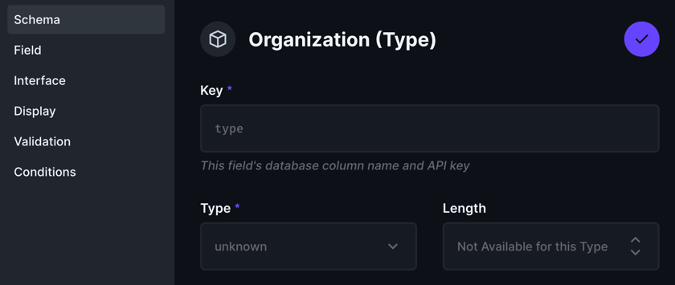
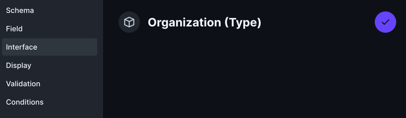
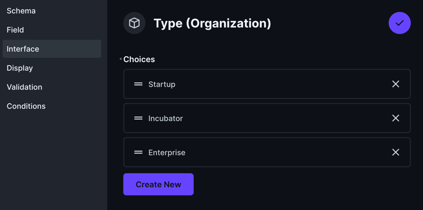
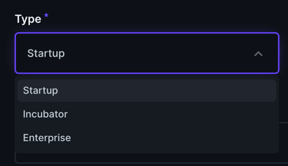
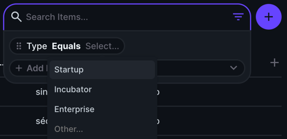

# Using dropdown for PostgreSQL Enums into Directus with `directus-sync`

Enumerated types (enums) in PostgreSQL provide a way to limit values in a column to a predefined set, improving data
integrity and user input validation. However, Directus does not natively support PostgreSQL enums and treats them as
`unknown` types. Moreover, you cannot choose the interface type for an enum field in Directus, which defaults to a
text input. A common interface for enums would be a dropdown.

This guide will show you how to use `directus-sync` to change the interface type for an enum field to a dropdown in
Directus.

## What you see in Directus

When you use an existing PostgreSQL table with an enum field in Directus, you will see the following:

**Schema**



**Interface**



## A Workaround with directus-sync

`directus-sync` can be used to bridge the gap between PostgreSQL enums and Directus dropdowns.
Here's a step-by-step guide on how to achieve this:

1. **Initial Configuration**: Set up the `directus-sync` CLI as
   described [here](https://github.com/tractr/directus-sync).
2. **Dump Directus Configurations**: Run `npx directus-sync pull` to export your Directus instance's configuration
   into separate JSON files. This step leverages
   the [snapshot endpoint of Directus](https://docs.directus.io/reference/system/schema.html#retrieve-schema-snapshot).
3. **Modify the Enum Field Configuration**: Identify and edit the JSON file corresponding to the enum field. For
   instance, if adjusting an enum field within the `organization` collection, you might find the file
   at `directus-config/snapshot/fields/organization/type.json`. Here, you can manually set the `meta.interface` to
   "dropdown" and define `meta.options` to reflect the enum values.

   Example JSON adjustment:

   ```json
   {
     "collection": "organization",
     "field": "type",
     "type": "unknown",
     "meta": {
       "collection": "organization",
       "conditions": null,
       "display": "raw",
       "display_options": null,
       "field": "type",
       "group": null,
       "hidden": false,
       "interface": "select-dropdown",
       "note": null,
       "options": {
         "choices": [
           {
             "value": "startup",
             "text": "Startup"
           },
           {
             "value": "incubator",
             "text": "Incubator"
           },
           {
             "value": "enterprise",
             "text": "Enterprise"
           }
         ]
       },
       "readonly": false,
       "required": true,
       "sort": 4,
       "special": null,
       "translations": null,
       "validation": null,
       "validation_message": null,
       "width": "half"
     },
     "schema": {
       "name": "type",
       "table": "organization",
       "data_type": "\"OrganizationType\"",
       "default_value": null,
       "max_length": null,
       "numeric_precision": null,
       "numeric_scale": null,
       "is_nullable": false,
       "is_unique": false,
       "is_primary_key": false,
       "is_generated": false,
       "generation_expression": null,
       "has_auto_increment": false,
       "foreign_key_table": null,
       "foreign_key_column": null
     }
   }
   ```
4. **Push the Changes**: Apply the edited schema back to your Directus instance with `npx directus-sync push`, updating
   the UI to display the dropdown as expected.

## Results

After pushing the changes, you will see the following:

**Interface**



**Form**



**Search filter**



## Considerations

Currently, we are not able to implement this with a multi-select dropdown. In Postgres, the format for a list of
enums is `{value1,value2,value3}`. Directus doesn't natively parse and stringify this format. A custom transformer,
like `cast-csv`, could potentially be incorporated
here: [Directus Payload Service](https://github.com/directus/directus/blob/main/api/src/services/payload.ts#L130-L145).
