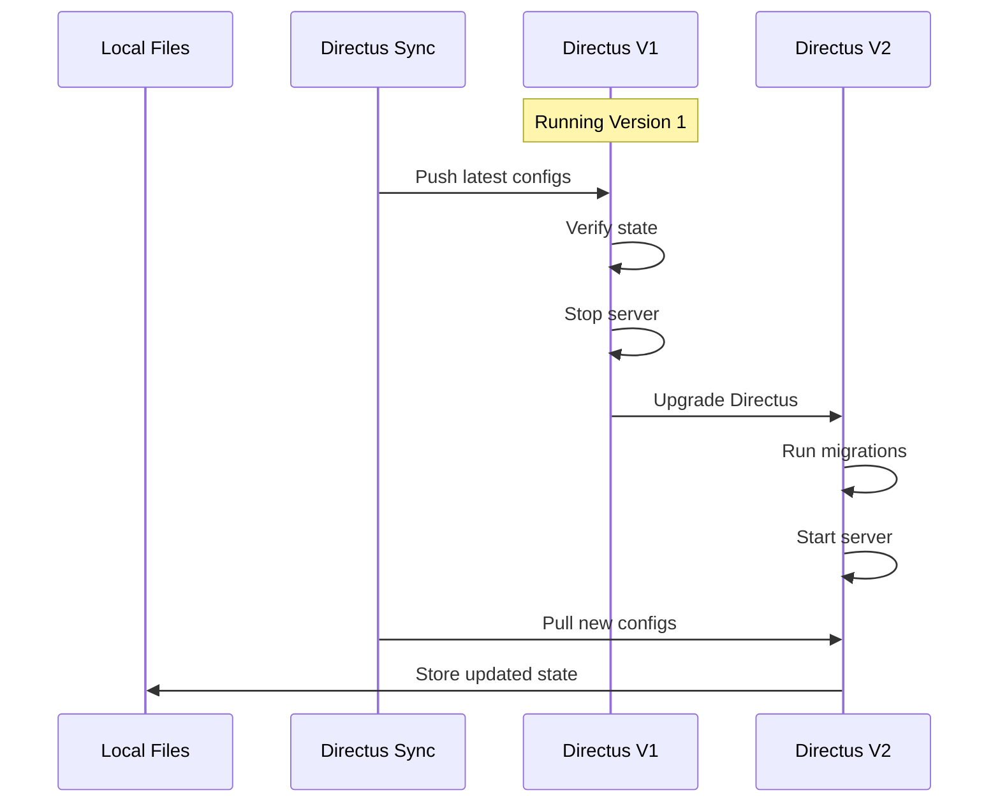

# Directus Upgrades

Upgrading Directus requires careful consideration of your configurations and synchronization state. This guide explains how to safely upgrade Directus while maintaining your synchronized configurations.

## Upgrade Process



## Step-by-Step Guide

### 1. Pre-Upgrade Preparation

```bash
# Ensure current state is synchronized
npx directus-sync diff

# Push any pending changes
npx directus-sync push

# Create a backup
npx directus-sync pull --dump-path ./backup
```

### 2. Version Check

```bash
# Check current Directus version
npx directus version

# Review compatibility matrix
npx directus-sync --version
```

### 3. Upgrade Process

1. **Stop Directus**:
   ```bash
   # Docker
   docker-compose down

   # Or stop your Directus process
   ```

2. **Update Version**:
   ```json
   {
     "dependencies": {
       "directus": "^11.0.0"
     }
   }
   ```

3. **Install Updates**:
   ```bash
   npm install
   # or
   yarn install
   ```

4. **Start Directus**:
   ```bash
   # Docker
   docker-compose up -d

   # Or start your Directus process
   ```

### 4. Post-Upgrade Steps

```bash
# Pull new configuration state
npx directus-sync pull

# Review changes
npx directus-sync diff

# Push any necessary adjustments
npx directus-sync push
```

## Version-Specific Considerations

### Major Version Upgrades

When upgrading between major versions (e.g., 10.x to 11.x):

1. **Schema Changes**:
   ```bash
   # Before upgrade
   npx directus-sync pull --no-snapshot

   # After upgrade
   npx directus-sync pull
   ```

2. **Configuration Updates**:
   ```bash
   # Review specific collections
   npx directus-sync diff --only-collections roles,permissions

   # Update if needed
   npx directus-sync push --only-collections roles,permissions
   ```

### Minor Version Upgrades

For minor version updates (e.g., 11.1 to 11.2):

```bash
# Quick upgrade process
npx directus-sync pull && npx directus-sync push
```

## Handling Breaking Changes

### Schema Modifications

```javascript
// directus-sync.config.js
module.exports = {
  hooks: {
    snapshot: {
      onLoad: async (snapshot) => {
        // Handle schema changes
        if (process.env.DIRECTUS_VERSION === '11.0.0') {
          // Modify schema for version 11
          snapshot.collections = snapshot.collections.map(/* ... */);
        }
        return snapshot;
      },
    },
  },
};
```

### Collection Updates

```javascript
module.exports = {
  hooks: {
    roles: {
      onSave: (roles) => {
        // Update role structure for new version
        return roles.map(role => ({
          ...role,
          // Add new required fields
          enforce_tfa: false,
        }));
      },
    },
  },
};
```

## Best Practices

### 1. Testing

```bash
# Create test environment
docker-compose -f docker-compose.test.yml up -d

# Test upgrade process
npx directus-sync push --directus-url http://localhost:8055

# Verify functionality
npx directus-sync diff
```

### 2. Backup Strategy

```bash
# Backup database
pg_dump directus > backup.sql

# Backup configurations
npx directus-sync pull --dump-path ./backup-$(date +%Y%m%d)

# Document version
echo "Directus $(npx directus version)" > backup/VERSION
```

### 3. Rollback Plan

```bash
# Store old version details
cp docker-compose.yml docker-compose.old.yml

# Create rollback script
cat > rollback.sh << 'EOF'
#!/bin/bash
docker-compose down
mv docker-compose.old.yml docker-compose.yml
docker-compose up -d
npx directus-sync push --dump-path ./backup
EOF
```

## Common Issues

### 1. Version Mismatch

```bash
# Force diff if versions don't match
npx directus-sync diff --force

# Update configuration if needed
npx directus-sync push --force
```

### 2. Schema Conflicts

```bash
# Reset schema tracking
npx directus-sync pull --no-snapshot

# Re-initialize schema
npx directus-sync pull
```

### 3. Permission Issues

```bash
# Clean up permissions
npx directus-sync helpers remove-permission-duplicates

# Reinitialize permissions
npx directus-sync pull --only-collections permissions
```

## Next Steps

- Understand [lifecycle and hooks](lifecycle-and-hooks.md)
- Review [tracked elements](tracked-elements.md)
- Check [troubleshooting guide](../troubleshooting/firewall-configurations.md) 