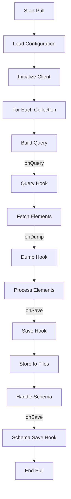
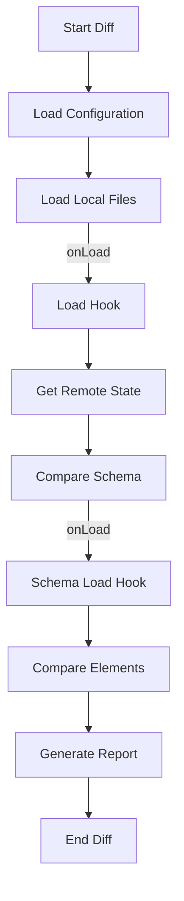
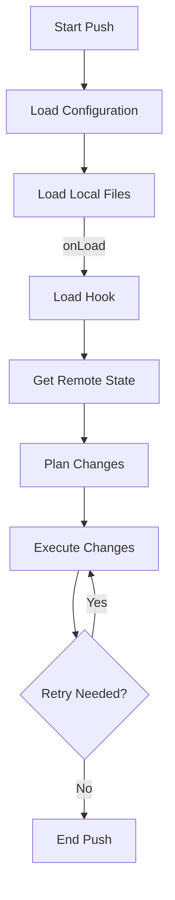

# Lifecycle and Hooks

Understanding the lifecycle of Directus Sync commands and their hook points is crucial for implementing custom behaviors and handling complex synchronization scenarios.

## Command Lifecycle

### Pull Command



### Diff Command



### Push Command



## Hook Points

### Collection Hooks

#### Query Phase

```typescript
interface QueryHook {
  onQuery?: (
    query: Record<string, any>,
    client: DirectusClient
  ) => Record<string, any>;
}

// Example: Filter test environments
hooks: {
  flows: {
    onQuery: (query) => ({
      ...query,
      filter: {
        environment: { _neq: 'test' },
      },
    }),
  },
}
```

#### Dump Phase

```typescript
interface DumpHook {
  onDump?: (
    elements: any[],
    client: DirectusClient
  ) => Promise<any[]> | any[];
}

// Example: Enrich data
hooks: {
  operations: {
    onDump: async (operations, client) => {
      for (const op of operations) {
        const flow = await client.request(
          readFlow(op.flow)
        );
        op.flowName = flow.name;
      }
      return operations;
    },
  },
}
```

#### Save Phase

```typescript
interface SaveHook {
  onSave?: (
    elements: any[],
    client: DirectusClient
  ) => Promise<any[]> | any[];
}

// Example: Clean sensitive data
hooks: {
  settings: {
    onSave: (settings) => settings.filter(
      s => !s.key.includes('secret')
    ),
  },
}
```

#### Load Phase

```typescript
interface LoadHook {
  onLoad?: (
    elements: any[],
    client: DirectusClient
  ) => Promise<any[]> | any[];
}

// Example: Transform data
hooks: {
  translations: {
    onLoad: (translations) => translations.map(
      t => ({ ...t, value: t.value.trim() })
    ),
  },
}
```

### Schema Hooks

#### Schema Load

```typescript
interface SchemaLoadHook {
  onLoad?: (
    snapshot: Snapshot,
    client: DirectusClient
  ) => Promise<Snapshot> | Snapshot;
}

// Example: Modify schema
hooks: {
  snapshot: {
    onLoad: (snapshot) => {
      snapshot.fields = snapshot.fields.map(field => ({
        ...field,
        options: {
          ...field.options,
          defaultValue: null,
        },
      }));
      return snapshot;
    },
  },
}
```

#### Schema Save

```typescript
interface SchemaSaveHook {
  onSave?: (
    snapshot: Snapshot,
    client: DirectusClient
  ) => Promise<Snapshot> | Snapshot;
}

// Example: Add metadata
hooks: {
  snapshot: {
    onSave: (snapshot) => ({
      ...snapshot,
      meta: {
        timestamp: new Date().toISOString(),
      },
    }),
  },
}
```

## Advanced Use Cases

### Conditional Processing

```javascript
module.exports = {
  hooks: {
    flows: {
      onQuery: (query) => {
        if (process.env.NODE_ENV === 'production') {
          return {
            ...query,
            filter: { status: 'active' },
          };
        }
        return query;
      },
    },
  },
}
```

### Cross-Collection Operations

```javascript
module.exports = {
  hooks: {
    roles: {
      onDump: async (roles, client) => {
        for (const role of roles) {
          const permissions = await client.request(
            readPermissions({
              filter: { role: role.id },
            })
          );
          role.permissionCount = permissions.length;
        }
        return roles;
      },
    },
  },
}
```

### Schema Transformations

```javascript
module.exports = {
  hooks: {
    snapshot: {
      onLoad: (snapshot) => {
        // Add computed fields
        snapshot.fields.push({
          collection: 'articles',
          field: 'full_name',
          type: 'alias',
          meta: {
            special: ['alias', 'no-data'],
            interface: 'presentation',
          },
        });
        return snapshot;
      },
    },
  },
}
```

## Best Practices

### 1. Hook Organization

```javascript
// hooks/index.js
module.exports = {
  roles: require('./roles'),
  flows: require('./flows'),
  snapshot: require('./snapshot'),
};

// hooks/roles.js
module.exports = {
  onQuery: require('./roles/query'),
  onDump: require('./roles/dump'),
  onSave: require('./roles/save'),
  onLoad: require('./roles/load'),
};
```

### 2. Error Handling

```javascript
module.exports = {
  hooks: {
    operations: {
      onDump: async (operations, client) => {
        try {
          const enriched = await Promise.all(
            operations.map(async (op) => {
              try {
                const flow = await client.request(
                  readFlow(op.flow)
                );
                return { ...op, flowName: flow.name };
              } catch (err) {
                console.error(
                  `Failed to enrich operation ${op.id}:`,
                  err
                );
                return op;
              }
            })
          );
          return enriched;
        } catch (err) {
          console.error('Hook failed:', err);
          return operations;
        }
      },
    },
  },
}
```

### 3. Performance Optimization

```javascript
module.exports = {
  hooks: {
    flows: {
      onDump: async (flows, client) => {
        // Batch requests
        const flowIds = flows.map(f => f.id);
        const operations = await client.request(
          readOperations({
            filter: { flow: { _in: flowIds } },
          })
        );
        
        // Use lookup table
        const opsByFlow = operations.reduce(
          (acc, op) => {
            acc[op.flow] = acc[op.flow] || [];
            acc[op.flow].push(op);
            return acc;
          },
          {}
        );
        
        return flows.map(flow => ({
          ...flow,
          operationCount: opsByFlow[flow.id]?.length || 0,
        }));
      },
    },
  },
}
```

## Next Steps

- Review [tracked elements](tracked-elements.md)
- Learn about [Directus upgrades](directus-upgrades.md)
- Explore [use cases](../use-cases/postgresql-enum.md) 