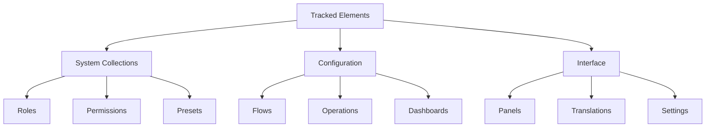

# Tracked Elements

Directus Sync tracks various elements within your Directus instance. Understanding how each element type is tracked is crucial for effective synchronization.

## Overview

### Tracked Collections



## System Collections

### Roles & Policies

```json
{
  "collection": "directus_roles",
  "data": [
    {
      "_sync_id": "editor_role",
      "name": "Editor",
      "admin_access": false,
      "app_access": true
    }
  ]
}
```

Special handling:
- Admin role uses CLI user's role
- Default policies are preserved
- Role-based permissions are linked via SyncIDs

### Permissions

```json
{
  "collection": "directus_permissions",
  "data": [
    {
      "_sync_id": "editor_articles_read",
      "role": "_sync_editor_role",
      "collection": "articles",
      "action": "read",
      "permissions": { /* ... */ }
    }
  ]
}
```

Key features:
- Role references use SyncIDs
- Permissions are unique per role/collection/action
- Supports granular access control

### Presets

```json
{
  "collection": "directus_presets",
  "data": [
    {
      "_sync_id": "articles_list_preset",
      "role": "_sync_editor_role",
      "collection": "articles",
      "layout": "tabular"
    }
  ]
}
```

Tracking rules:
- Global presets are tracked
- Role-based presets are tracked
- User-specific presets are ignored

## Configuration Elements

### Flows & Operations

```json
{
  "collection": "directus_flows",
  "meta": {
    "preserve_ids": true
  },
  "data": [
    {
      "_sync_id": "notification_flow",
      "name": "Send Notification",
      "status": "active",
      "trigger": "webhook",
      "options": { /* ... */ }
    }
  ]
}
```

Special considerations:
- Flow IDs are preserved for webhook URLs
- Operations maintain flow references
- Trigger configurations are preserved

### Dashboards & Panels

```json
{
  "collection": "directus_dashboards",
  "data": [
    {
      "_sync_id": "analytics_dashboard",
      "name": "Analytics",
      "panels": ["_sync_visitors_panel"]
    }
  ]
}
```

Relationships:
- Panels are linked to dashboards
- Panel layouts are preserved
- Panel data sources are maintained

## Interface Elements

### Translations

```json
{
  "collection": "directus_translations",
  "data": [
    {
      "_sync_id": "welcome_message_fr",
      "language": "fr-FR",
      "key": "welcome_message",
      "value": "Bienvenue"
    }
  ]
}
```

Features:
- Multi-language support
- Key-based translations
- Language-specific overrides

### Settings

```json
{
  "collection": "directus_settings",
  "data": [
    {
      "_sync_id": "project_settings",
      "project_name": "My Project",
      "project_url": "https://example.com"
    }
  ]
}
```

Handling:
- Global settings are tracked
- Sensitive data can be filtered
- Environment-specific settings supported

## ID Preservation

Some elements require ID preservation:

```bash
# Preserve specific collection IDs
npx directus-sync pull --preserve-ids flows,folders

# Preserve all possible IDs
npx directus-sync pull --preserve-ids all
```

### Always Preserved

- **Flows**: For webhook URL consistency
- **Folders**: For file/image field associations

### Optionally Preserved

- Dashboards
- Operations
- Panels
- Policies
- Roles
- Translations

## Best Practices

### ID Management

1. **Planning**:
   - Decide which IDs to preserve
   - Document ID preservation strategy
   - Consider cross-environment impacts

2. **Implementation**:
   - Use consistent SyncID naming
   - Maintain ID relationships
   - Test ID preservation

### Relationship Handling

1. **Direct References**:
   ```json
   {
     "role": "_sync_editor_role",
     "collection": "articles"
   }
   ```

2. **Nested References**:
   ```json
   {
     "panels": ["_sync_panel_1", "_sync_panel_2"],
     "options": {
       "related_role": "_sync_viewer_role"
     }
   }
   ```

### Filtering

1. **Collection Level**:
   ```bash
   npx directus-sync pull --exclude-collections settings,translations
   ```

2. **Element Level**:
   ```javascript
   hooks: {
     settings: {
       onSave: (settings) => settings.filter(
         s => !s.key.startsWith('private_')
       )
     }
   }
   ```

## Next Steps

- Learn about [Directus upgrades](directus-upgrades.md)
- Understand [lifecycle and hooks](lifecycle-and-hooks.md)
- Explore [use cases](../use-cases/postgresql-enum.md) 