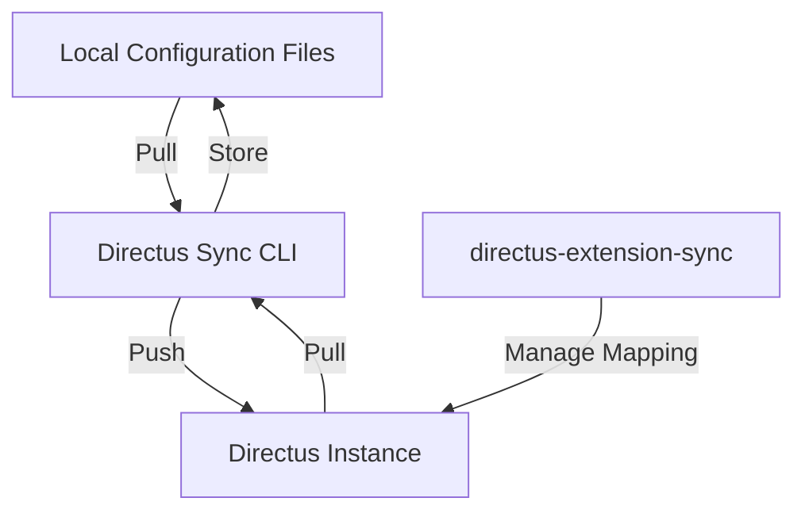

# How It Works

Directus Sync operates similarly to infrastructure-as-code tools like Terraform, using a tagging system to track and manage configurations across different Directus instances. Here's an overview of how it works:

## Core Principles

### Version Control for Directus

Directus Sync treats your Directus configuration as code, allowing you to:
- Track changes in your version control system
- Review configuration modifications
- Roll back to previous states
- Collaborate with team members

### Tracking System

Each trackable element within Directus (dashboards, flows, permissions, etc.) receives a unique synchronization identifier (SyncID). This system enables:
- Consistent identification across environments
- Reliable updates and synchronization
- Preservation of relationships between elements

### Granular Updates

Instead of replacing entire configurations, Directus Sync:
- Identifies specific changes needed
- Updates only modified elements
- Preserves existing data and relationships
- Maintains configuration history

## Architecture Overview

## Key Components

1. **CLI Tool**: The main interface for managing synchronization
2. **Extension**: Required component installed on Directus for tracking
3. **Mapping Table**: Links SyncIDs with Directus internal IDs
4. **Configuration Files**: JSON files storing your Directus setup

## Next Steps

- Learn about the [tagging system](tagging-and-tracking.md)
- Understand how the [mapping table](mapping-table.md) works
- Explore the [synchronization process](synchronization-process.md) 