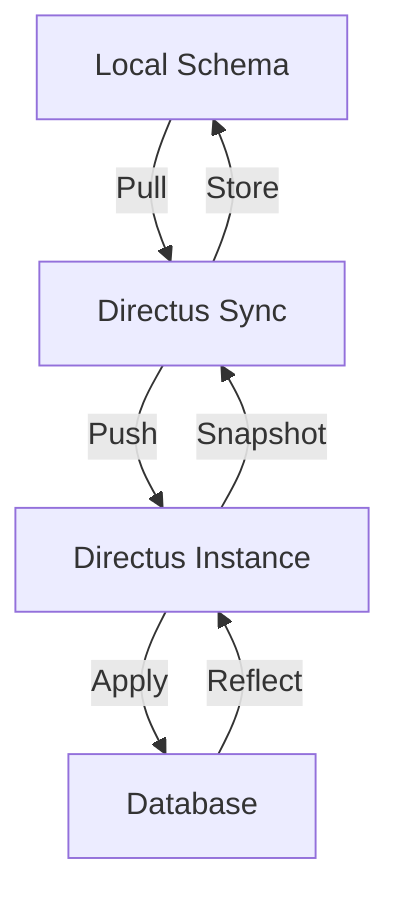

# Schema Management

Directus Sync manages database schema through Directus's schema snapshot system, providing version control and synchronization capabilities for your data model.

## Schema Snapshots

### What is a Schema Snapshot?

A schema snapshot is a complete representation of your Directus instance's data model, including:
- Collections
- Fields
- Relations
- Field Groups
- Custom Displays
- Interfaces
- Layouts

### Storage Format

By default, schema snapshots are:
- Stored in the `snapshot` directory
- Split into multiple files for better readability
- Formatted in JSON for version control

```
directus-config/
└── snapshot/
    ├── collections/
    │   ├── articles.json
    │   └── categories.json
    ├── fields/
    │   ├── articles.json
    │   └── categories.json
    └── relations/
        └── articles_categories.json
```

## Synchronization Process



### During Pull

1. **Snapshot Creation**
   - Retrieves current schema from Directus
   - Organizes into structured format
   - Splits into multiple files if configured

2. **Validation**
   - Checks schema integrity
   - Validates relationships
   - Ensures field compatibility

### During Push

1. **Comparison**
   - Loads local schema files
   - Compares with remote schema
   - Plans necessary changes

2. **Application**
   - Applies changes in correct order
   - Handles field dependencies
   - Manages relationships

## Special Considerations

### Field Types

Directus Sync handles various field types:

```typescript
interface Field {
  collection: string;
  field: string;
  type: string;      // SQL type
  meta: {
    interface: string;    // Directus interface
    display: string;     // Display format
    options: object;     // Interface options
    // ... other metadata
  };
}
```

### Relations

Relations are managed carefully to maintain:
- Foreign key constraints
- Many-to-many relationships
- Junction tables
- Sorting fields

### System Collections

System collections (prefixed with `directus_`) are:
- Protected from modification
- Excluded from schema management
- Handled through collection management

## Best Practices

1. **Version Control**
   - Commit schema changes separately
   - Review changes before push
   - Document major changes

2. **Testing**
   - Test schema changes in development
   - Use `diff` command before push
   - Backup production data

3. **Organization**
   - Use consistent naming conventions
   - Group related changes
   - Maintain documentation

## Next Steps

- Explore [configuration options](../features/configuration.md)
- Learn about [hooks](../features/hooks.md)
- Understand [Directus upgrades](../advanced/directus-upgrades.md) 