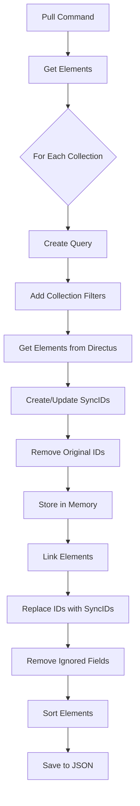
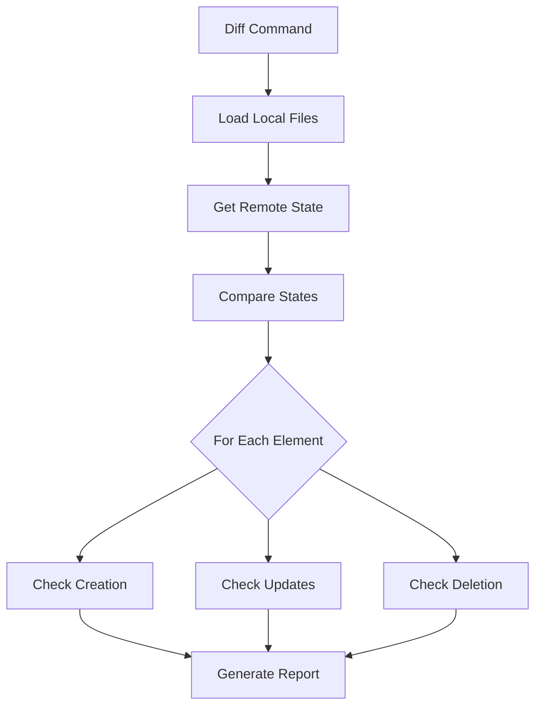
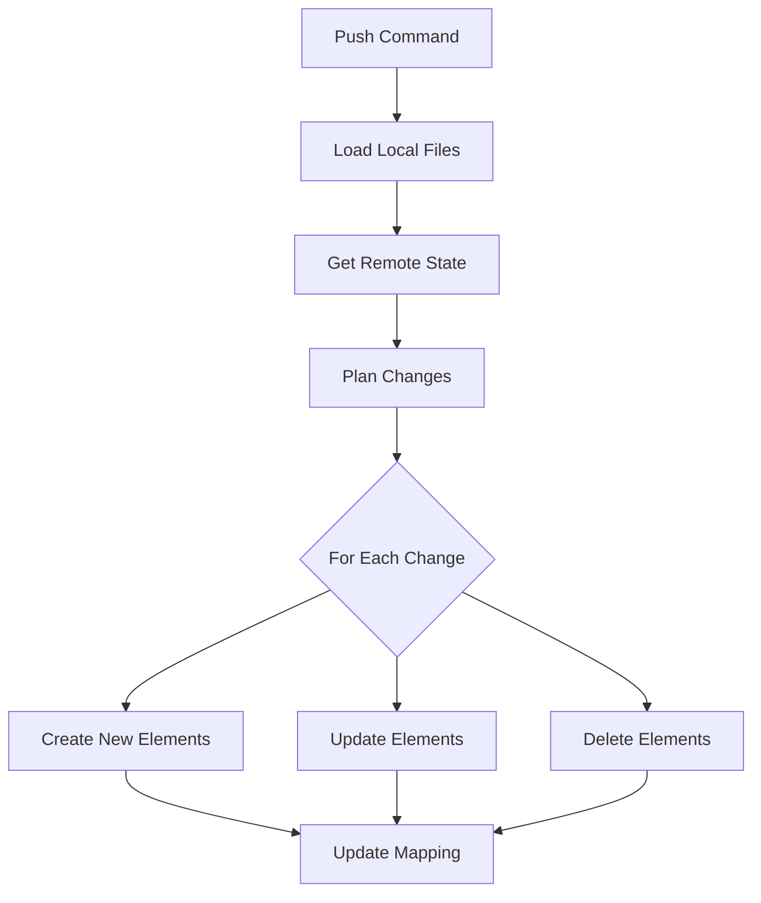

# Synchronization Process

The synchronization process in Directus Sync is designed to be safe, predictable, and efficient. Let's dive into how each command works in detail.

## Pull Process

### Steps in Detail

1. **Query Creation**
   - Builds API queries for each collection
   - Applies any collection-specific filters
   - Handles pagination if needed

2. **Element Processing**
   - Retrieves elements from Directus
   - Assigns or updates SyncIDs
   - Removes internal IDs (unless preserved)
   - Stores processed elements

3. **Relationship Handling**
   - Links related elements using SyncIDs
   - Maintains referential integrity
   - Resolves circular dependencies

4. **Storage**
   - Organizes elements by collection
   - Saves to JSON files
   - Maintains file structure

## Diff Process

### Comparison Logic

1. **Creation Detection**
   - Identifies elements in local files not in Directus
   - Validates required fields
   - Checks dependencies

2. **Update Detection**
   - Compares local and remote versions
   - Identifies changed fields
   - Validates relationships

3. **Deletion Detection**
   - Identifies elements in Directus not in local files
   - Checks for dependencies
   - Ensures safe deletion

## Push Process

### Execution Strategy

1. **Change Planning**
   - Orders operations based on dependencies
   - Groups related changes
   - Validates change safety

2. **Execution**
   - Creates new elements first
   - Updates existing elements
   - Deletes removed elements
   - Updates mapping table

3. **Error Handling**
   - Retries failed operations
   - Handles API limitations
   - Provides detailed error messages

## Handling Special Cases

### Circular Dependencies

Directus Sync handles circular dependencies by:
1. Detecting dependency cycles
2. Creating elements without dependencies first
3. Updating relationships in subsequent passes

### Retries and Recovery

The push process includes retry logic for:
- API rate limits
- Temporary network issues
- Dependency resolution failures

## Next Steps

- Learn about [schema management](schema-management.md)
- Explore [advanced features](../features/configuration.md)
- Understand [lifecycle hooks](../advanced/lifecycle-and-hooks.md) 