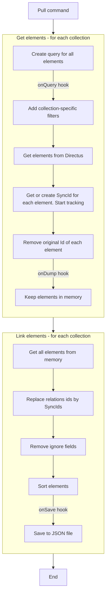

# Synchronization Process

The synchronization process is split into two main commands:

- `diff`: This command performs a comparison between the local JSON files generated by `pull` and the current state of a Directus instance. It outlines the elements that need to be created, updated, or deleted to achieve synchronization.

- `push`: This command executes the actual synchronization plan, applying the necessary changes to the Directus instance. It handles dependencies and circular dependencies carefully by potentially running the synchronization process multiple times until the Directus instance is fully in sync with the JSON definitions.

## Command Lifecycle

### Pull Command

