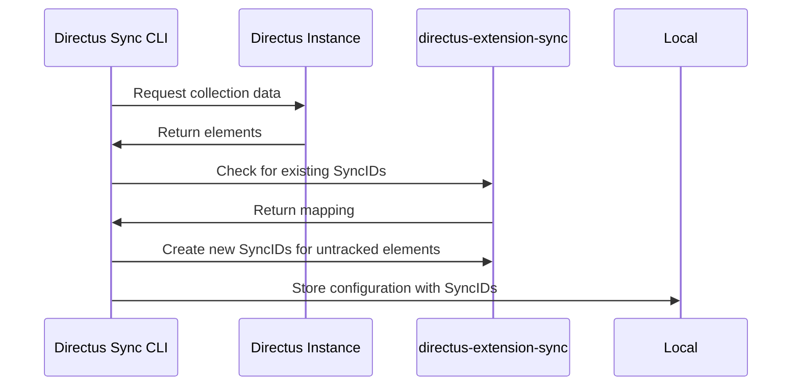

# Tagging and Tracking

The tagging system is at the core of how Directus Sync manages and tracks configurations across different environments.

## How Tagging Works

When you run the `pull` command, Directus Sync:

1. Scans specified collections in your Directus instance
2. Assigns a unique SyncID to each untracked element
3. Records these IDs in the mapping table
4. Stores the configuration data locally

## Tracked Elements

Directus Sync tracks the following elements:

- Dashboards
- Flows
- Folders
- Operations
- Panels
- Permissions
- Policies
- Presets
- Roles
- Settings
- Translations

## Special Cases

### Preserved IDs

Some elements require their original IDs to be preserved:

- **Flows**: To maintain webhook URLs
- **Folders**: To preserve file and image field associations

You can also preserve IDs for other collections using the `--preserve-ids` option:

```bash
npx directus-sync pull --preserve-ids roles,panels
```

### Default Elements

Directus Sync handles default elements specially:

- **Admin Role**: Uses the CLI user's role
- **Public Policy**: Uses the first policy with `role = null`
- **Admin Policy**: Uses the first policy linked to admin role with `admin_access = true`

## Tracking Process



## Benefits

This tagging system provides several advantages:

1. **Consistency**: Elements maintain their identity across environments
2. **Reliability**: Updates target the correct elements
3. **Flexibility**: Works with different instance configurations
4. **Traceability**: Changes can be tracked and audited

## Next Steps

- Learn about the [mapping table](mapping-table.md) that stores these relationships
- Understand how [synchronization](synchronization-process.md) uses these tags
- Explore [schema management](schema-management.md) 