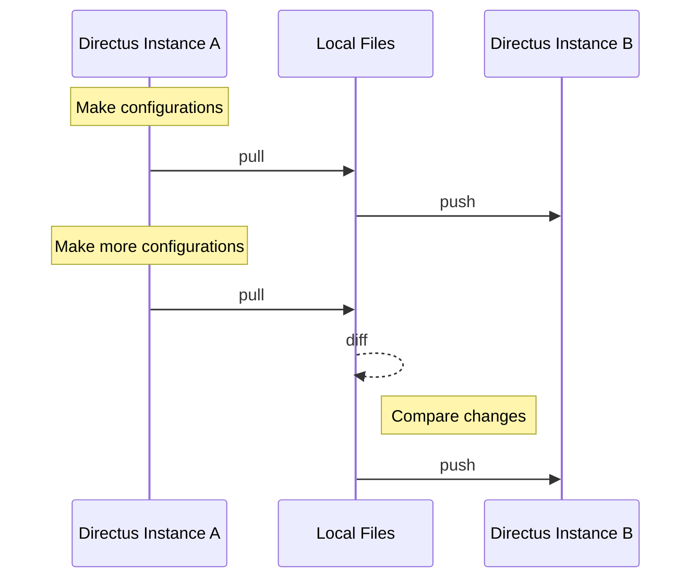

# Synchronization

## Basic Workflow



## Pull

```shell
npx directus-sync pull
```

Retrieves the current schema and collections from Directus and stores them locally. This command does not modify the database.

It also retrieves the specifications (GraphQL & OpenAPI) and stores them locally. It gets specifications from the `/server/specs/*` endpoints:
- [OpenAPI](https://docs.directus.io/reference/system/server.html#get-openapi-specification)
- [GraphQL SDL (Item & System scopes)](https://docs.directus.io/reference/system/server.html#get-graphql-schema)

## Diff

```shell
npx directus-sync diff
```

Analyzes and describes the difference (diff) between your local schema and collections and the state of the Directus instance. This command is non-destructive and does not apply any changes to the database.

## Push

```shell
npx directus-sync push
```

Applies the changes from your local environment to the Directus instance. This command pushes your local schema and collection configurations to Directus, updating the instance to reflect your local state.

## Common Options

All commands support these options:

```bash
Options:
  -c, --config-path <path>        Path to config file
  -d, --debug                     Enable debug logging
  -u, --directus-url <url>        Directus instance URL
  -t, --directus-token <token>    Access token
  -e, --directus-email <email>    Admin email (if no token)
  -p, --directus-password <pass>  Admin password (if no token)
  --dump-path <path>              Base path for dumps
  --collections-path <path>       Collections dump path
  --snapshot-path <path>          Schema snapshot path
  --specs-path <path>            API specs dump path
  -h, --help                     Display help
```

## Collection Management

### Include/Exclude Collections

Include only specific collections

```bash
npx directus-sync pull --only-collections roles,permissions
```

Exclude specific collections

```bash
npx directus-sync pull --exclude-collections settings
```

### ID Preservation

Preserve IDs for specific collections

```bash
npx directus-sync pull --preserve-ids roles,panels
```

Preserve all possible IDs
```bash
npx directus-sync pull --preserve-ids all
```

## Schema Options

Skip schema operations

```bash
npx directus-sync pull --no-snapshot
```

Keep schema in single file

```bash
npx directus-sync pull --no-split
```

Skip API specs

```bash
npx directus-sync pull --no-specs
```

## Advanced Usage

Force diff even with version mismatch

```bash
npx directus-sync diff --force
```

### Retry Configuration

Set maximum push retries.
Retries occur when a dependency between collections could not be resolved.

```bash
npx directus-sync push --max-push-retries 30
```

## Environment Variables

Instead of command-line options, you can use environment variables:

```bash
DIRECTUS_URL=https://directus.example.com
DIRECTUS_TOKEN=your-token
```

OR

```bash
DIRECTUS_ADMIN_EMAIL=admin@example.com
DIRECTUS_ADMIN_PASSWORD=your-password
```

> [!TIP]
> You can check the [configuration options](/docs/features/configuration) for more information.
