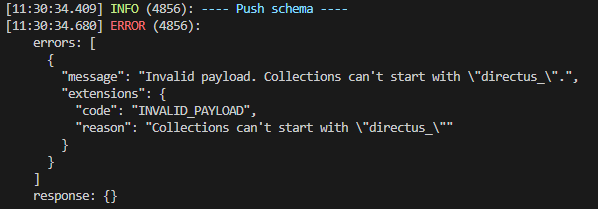

# Collections Prefix

If you're facing the error `Invalid payload. Collections can't start with "directus_".`
when running `directus-sync push`, as shown below:

This is likely due to a restriction in Directus that prevents the creation of the `directus_sync_id_map` collection
that is present in the snapshot.

This collection is essential for the operation of `directus-sync` but should not be created during the push operation.

This collection is created by the `directus-extension-sync` extension, which must be installed on your Directus
instance.

Therefore, to resolve this issue, ensure that you have installed
the [directus-extension-sync](https://www.npmjs.com/package/directus-extension-sync) on your target Directus instance.

You can refer to the [installation guide](../getting-started/installation.md) for more information.